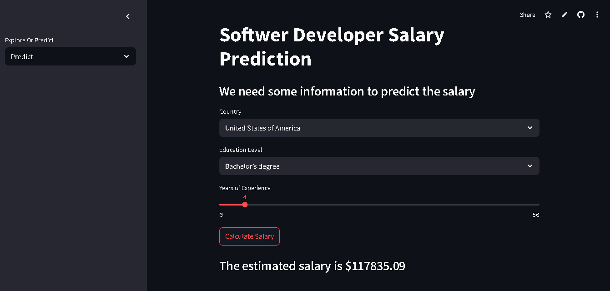
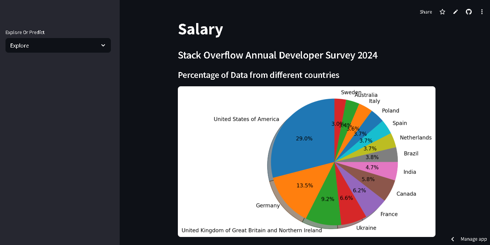
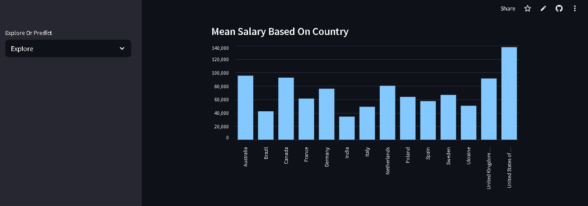
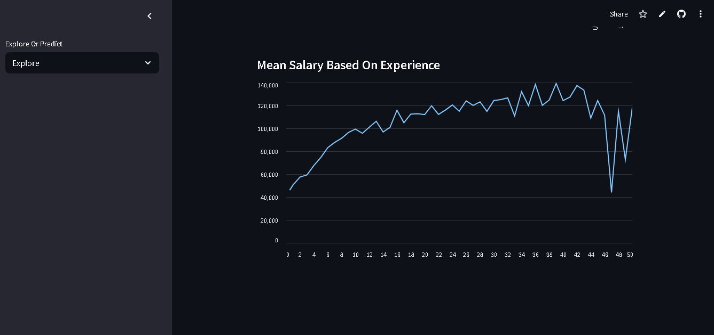

# Software Developer Salary Prediction App
## Overview:
This Streamlit application predicts software developer salaries based on country, education level, and years of experience. It also provides interactive data exploration dashboards using Stack Overflow's 2024 Developer Survey data.

[Softwer Developer Salary Prediction](https://ml-web-app-dzefxzjgce2krfmyqma3tl.streamlit.app)

### Key Features:
- Salary Prediction: ML-powered salary estimator
- Data Exploration: Interactive visualizations of global developer trends
- User-Friendly Interface: Simple sliders and dropdown inputs

## App Interface Preview
1. Prediction Interface

- Inputs:
  - Country selection (e.g., United States)
  - Education level (e.g., "Less than a Bachelors")
  - Years of experience slider
- Output: Predicted salary with USD conversion

2. Exploration Dashboard
   - Country distribution charts
     

   -  Salary trend visualizations

## Project Structure
salary-prediction-app
  - data                  # survey data
     - survey_results_public.csv
  - models                # Trained model pipeline
     - saved_steps.pkl
  - salary_app.py              # Main application
  - predict_page.py           # Prediction page logic
  - explore_page.py           # Dashboard page logic
  - salarypred.ipynb         # ETL and model training notebook
  - requirements.txt        # Dependencies
  - README.md

## Deployment via Streamlit Sharing:
- Push code to GitHub repository
- Connect GitHub account at 
- Select repo and set main file to salary_app.py
- Streamlit automatically installs dependencies from requirements.txt

# Thank You for Your Time! 
  
